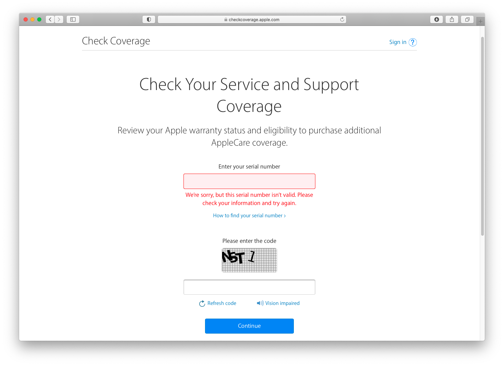
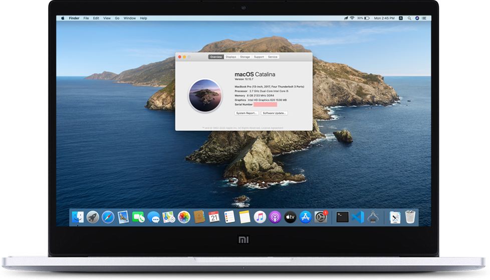

# Mi Laptop Air 13.3 Intel-I5-7200U Fingerprint Version Hackintosh (OpenCore)

### Supported macOS versions
+ macOS Catalina 10.15.7
+ macOS Big Sur 11.0

### Specs
+ OS: macOS Catalina 10.15.7 19H114 x86_64 / MacBookPro14,2
+ OpenCore: 0.6.4
+ CPU: Intel® Core™ i5-7200U CPU @ 2.50GHz
+ GPU: Intel HD Graphics 620 + NVIDIA GeForce MX150
+ Intel Generation: Kaby Lake
+ BIOS: XMAKB3M0P0907

### BIOS Settings
+ Secure Boot: **Disabled**

### One more thing
After macOS is successfully installed, please generate a new **Serial Number**, **Board Serial Number** and **SmUUID** with [Hackintool](https://github.com/headkaze/Hackintool) and replace them in *config.plist*.

Check your **Serial Number** on [https://checkcoverage.apple.com](https://checkcoverage.apple.com) and make sure the result is as shown below, otherwise go ahead and generate a new one and check it again.

---

## Show your support

Give a ⭐️ if this project helped you!
